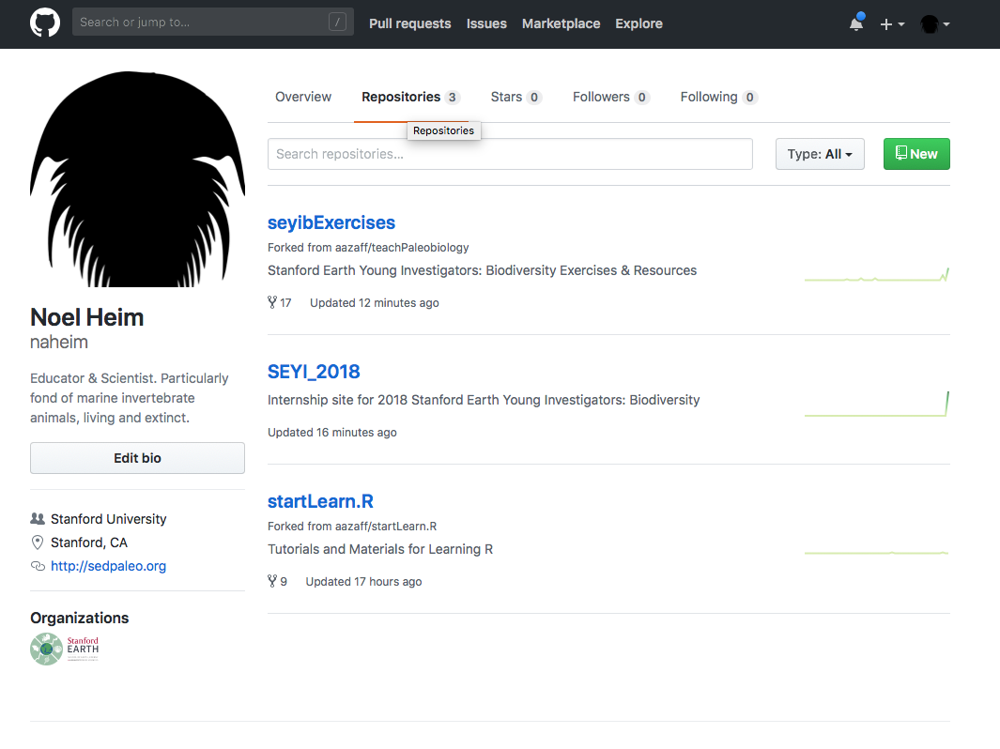
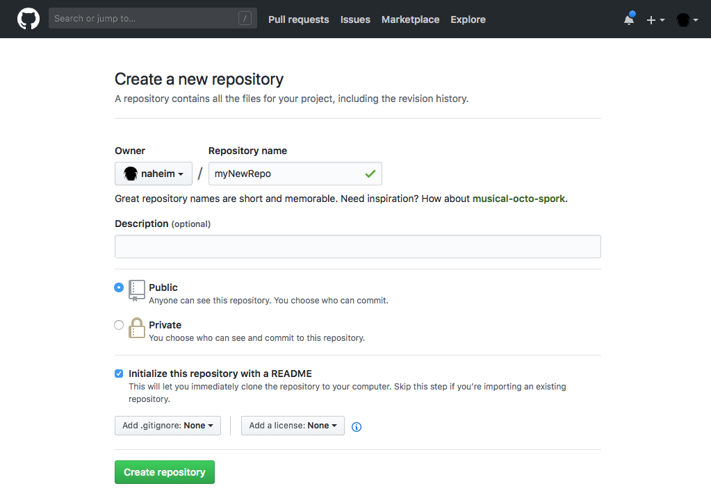

#### Modified from tutoral created by [Andrew Zaffos](https://github.com/aazaff) for the UW-Madison Paleobiology Course.

# Introduction

The following is a revised version of the git and GitHub tutorial. You can still access the [old git tutorial](https://github.com/naheim/teachPaleobiology/blob/master/GitTutorial/GitStarted.md) and list of [basic git commands](https://github.com/naheim/teachPaleobiology/blob/master/GitTutorial/BasicGitCommands.md). However, everything you need to get started with git (other than installation) is included in this tutorial.

## Installion and Setup

You can (and should) use the new [gitWindows](/GitTutorial/gitWindows.md) or [gitApple](/GitTutorial/gitApple.md) tutorials to install and set up git on your computer. 

## How to use git

A git repository exists both on **GitHub** (online) and on your **local** machine. It can also exist on machines other than yours (e.g., a project collaborator), but we will ignore that possiblity for the moment.

The key to successfully working with git is navigating the relationship between the **local copy** and the **GitHub** copy. This relationship is summarized by the concepts of ````pushing```` and ````pulling````.

## Creating a Repository
Step 1: Navigate to your profile on the GitHub website and click on the "Repositories" tab at the top.



Step 2: Click on New, to crate a new repository

Step 3: Give your new repository a name. Make sure 'Public' is checked (you need to pay to have private repositories'. Check 'Initialize this repository with a README', which will crate an initial markdown file for you to describe your project.



## Getting your repository onto your local computer
Now that you have your new repository, you want to put a copy onto your computer (we call this the local repository) so that you can work on edits, adding files, etc.  To do this you want to *clone* the repository that's on GitHub (we call this the remote repository).

Step 1: Open terminal and move to the folder where you want your local repository saved using the ````cd```` command. I have a foder on my computer called `git` where I keep all my local repositories.

Step 2: Clone your repository using the ``git clone https://github.com/naheim/myNewRepo`` command. This will create a new directory called ``myNewRepo`` with all the files and directories for that repository. Now your ready to start making changes and adding files.


## Pulling and Pushing
Pulling and pushing are very important concepts in git. You should understand them before you begin editing your local repository. 

<a href="url"></a>

1. Pulling is when you take a file that you added or edited on GitHub and sync it with your local machine.
2. Pushing is when you take a file that you added or edited to your local machine and sync it with GitHub.


## Making Edits on Your Local Machine

Step 1: Create files (subdirectories, R code, markdown files, etc.) and add them to your repository.

<a href="url"></a>

Step 2: Open terminal and move to the folder using the ````cd```` command.

<a href="url"></a>

Step 3: Type the following three commands into terminal. Substitute any message in the ````" "```` that you want associated with the file. GitHub requires that you leave a message of some kind. This could be something as simple as "Upload" or "New File" or "Screw You GitHub I don't want to leave a message".

````
git add .
git commit -m "Your Message"
git push
````

Step 4: You are done! DONE! You will now see the file online in your GitHub Repository. Repeat Steps 2-3 if you make any changes to the file on your local machine and want them uploaded to GitHub.

## Trouble Shooting

If you still have problems either with installing or using git, you can access this additional file on [troubleshooting git](/GitTutorial/GitTroubleshooting.md). If the tips in that file also do not work, please do not hesitate to contact me.
